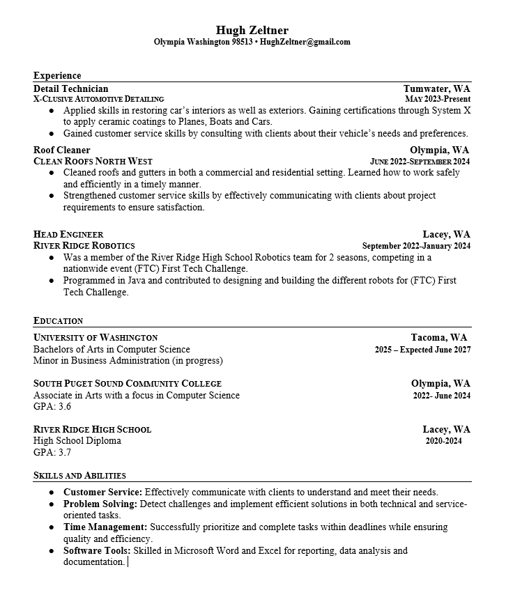

Hello I'm Hugh Zeltner I'm currently studying Computer Science and Business Administration with a strong interest in using technology to improve others everyday life.
I’m really passionate about exploring how technogly can help people interact more effectively with the world around them as well as take stress out of every day tasks.

.png)   

**About me**

Hello I'm Hugh Zeltner, I’m currently studying Computer Science and Business Administration at the University of Washington Tacoma. I’ve always been fascinated by how technogly is alwasys advancing, how people use it, and how it can make life easier when applied thoughtfully.

I’m working toward a career where I can connect people with meaningful technology, whether through software, product development, or technical communication. Helping others understand and use tech effectively is what motivates me.

Outside of academics, I love spending time outdoors. I enjoy rock climbing, and in the winter I like to skiing and snow shoe. These activities push me to stay focused, and always ready to learn just like in the tech feild.

## Table of Contents
- [About Me](About-me)
- [Contact me](#Contact-Me)
- [Education](#Education)
- [Technical Skills](#Technical-Skills)
- [Soft Skills](#Soft-Skills)
- [Work Expierence](#Work-Expierence)
- [Resume](#resume)

## Contact me
- [LinkedIn](https://www.linkedin.com/in/hugh-zeltner-a36956345/)
- Email: ZeltnerHugh@gmail.com

## Education
***University Of Washngtion Tacoma***                         Tacoma, WA
Bachelors of Arts in Computer Science & Minor in Business Administration(_2025 – Expected June 2027_)
(in progress)

---

***South Puget Sound Community College***                    Olympia, WA
Associate in Arts with a focus in Computer Science 	(_2022 - June 2024_)
GPA: 3.6

---

## Technical Skils
**Programing Lauanges**

Beginner Scratch, Beginner Java, Beginner Python      

**Integrated Development Environment (IDE)**

Jgrasph, Eclipse, intelliJ IDEA

---

## Soft skills

**Leadership and Teamwork**
: Led technical tasks and guided team members during robotics projects, ensuring goals were met efficiently and with high quality.
Collaborated with teammates and coworkers to complete projects safely and effectively, contributing ideas and supporting others to achieve shared goals.

**Communication**
: Communicated clearly with clients and team members to understand needs, explain solutions, and coordinate for meeting deadlines.

---
### Projects
**Java**

*Grade Tracker*

This Java program is a Grade Tracking System that allows users to enter multiple class names, record scores for each class, and automatically calculate useful statistics. It uses object oriented programming, Java Collections, user input handling, and basic data analysis.

**Key Features:**

-Add up to 5 classes using a JOptionPane pop-up window.
-Enter multiple scores for each class using the console.

**Automatically computes:**

-Class average
-Highest score
-Lowest score
-Overall average across all classes

**Python**

*Python Project 
*Multi Currency Converter*
This project is a MultiCurrency Converter that allows users to convert between several major world currencies using predefined exchange rates. It demonstrates strong Python fundamentals, including input handling, data structures, arithmetic operations, and clean program design.

*Supported Currencies:*
USD – United States Dollar

-EUR  Euro

-IQD  Iraqi Dinar

-BTC  Bitcoin

-JPY  Japanese Yen

**Key Features:**

Convert from any supported currency to another.

User-friendly text-based interface.

Stores exchange rates in a Python dictionary for easy updates.

Validates user input to prevent incorrect selections.

Calculates and displays the converted value with clean formatting.

---

## Work Expierence
**Detail Technician**
***X-Clusive Automotive Detailing*** *Tumwater, WA* (_May 2023 – Present_)

-Applied skills in restoring vehicle interiors and exteriors.

-Earned certifications through System X to apply ceramic coatings to planes, boats, and cars.

-Gained customer service skills by consulting with clients about their vehicle needs and preferences.

**Roof Cleaner** 
***Clean Roofs North West*** — *Olympia, WA* (_June 2022 – September 2024_)

-Cleaned roofs and gutters in both commercial and residential settings.

-Learned to work safely and efficiently in a time-sensitive environment.

-Strengthened customer service skills by clearly communicating project requirements to clients.

**Head Engineer** 
***River Ridge Robotics***  *Lacey, WA* (_September 2022 – January 2024_)

-Member of the River Ridge High School Robotics team for two seasons, competing in the nationwide FTC First Tech Challenge.

-Programmed in Java and contributed to designing and building various competition robots.

---

### Resume
[Download My Resume](https://github.com/zeltnhug/HughZeltnerPortfolio.github.io/blob/main/Hugh%20Z%20Resume%20October%202025.pdf)

